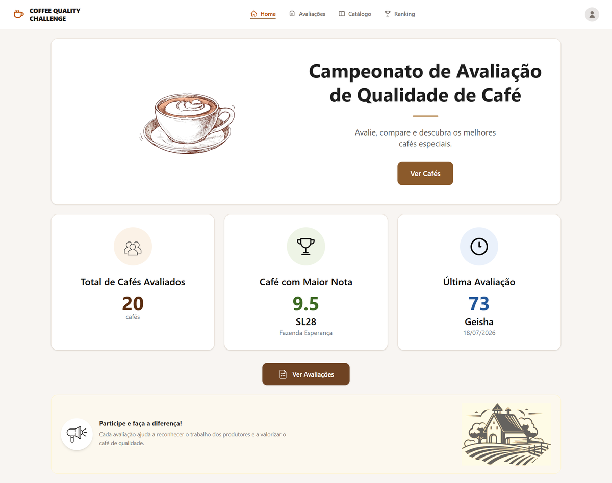
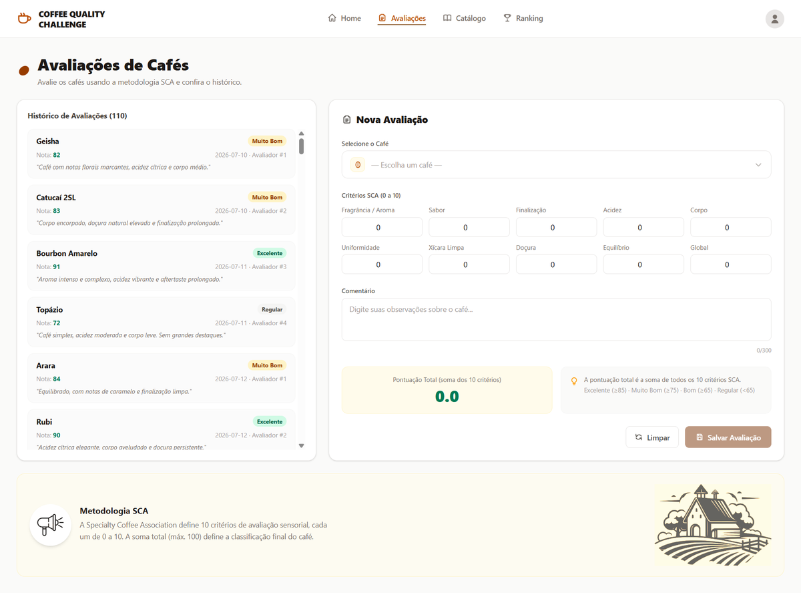
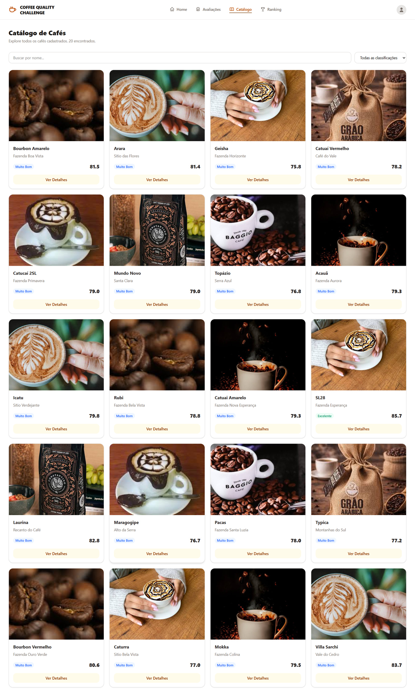
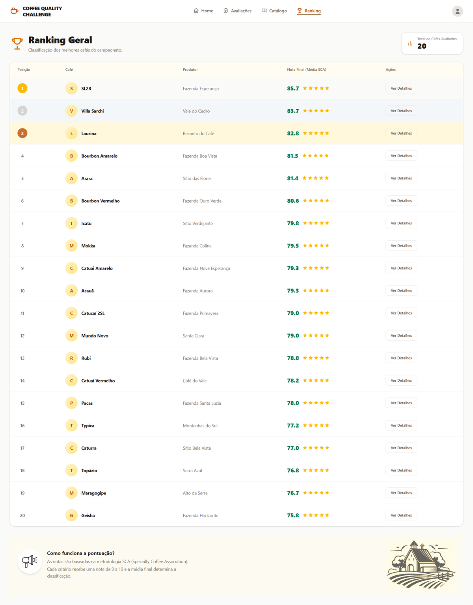

# ☕ Coffee Quality Challenge

<p align="center">
  
</p>

<p align="center">
  <strong>AT — Desenvolvimento Web II</strong><br>
  Instituto Federal Catarinense (IFC) — 2026
</p>

<p align="center">
  
  
  
  
  
</p>

---

## 📋 Sobre o Projeto

Sistema web para **avaliação sensorial de cafés especiais**, seguindo a metodologia da **Specialty Coffee Association (SCA)**. O objetivo é registrar e classificar diferentes amostras de café com base em critérios sensoriais, gerando um ranking automatizado.

> *"Transforme a arte da degustação em dados — avalie, compare e descubra os melhores cafés."*

---

## 🖼️ Screenshots

<div align="center">
  <table>
    <tr>
      <td width="50%"><br><em>🏠 Dashboard — Visão geral do campeonato</em></td>
      <td width="50%"><br><em>📝 Avaliações — Lista de cafés avaliados</em></td>
    </tr>
    <tr>
      <td width="50%"><br><em>🔍 Catálogo — Busca e filtros</em></td>
      <td width="50%"><br><em>🏆 Ranking — Classificação com Top 3</em></td>
    </tr>
  </table>
</div>

---

## 🧭 Rotas da Aplicação

| Rota | Página | Descrição |
|:-----|:-------|:----------|
| `/` | **Dashboard** | Indicadores do campeonato (total de cafés, melhor nota, última avaliação) |
| `/cafes` | **Avaliações** | Listagem de todos os cafés avaliados |
| `/avaliar` | **Nova Avaliação** | Formulário sensorial com cálculo automático da média |
| `/ranking` | **Ranking** | Classificação geral com destaque para o Top 3 |
| `/cafe/:id` | **Detalhes** | Ficha completa da avaliação de um café |
| `/*` | **404** | Página amigável para rotas inexistentes |

---

## 🛠️ Tecnologias

| Tecnologia | Versão | Função |
|:-----------|:-------|:-------|
| **Vue 3** | ^3.5 | Framework progressivo (Composition API) |
| **Vite** | ^8.0 | Build tool e dev server |
| **Vue Router** | ^5.1 | Roteamento SPA |
| **Pinia** | ^3.0 | Gerenciamento de estado global |
| **Tailwind CSS** | ^4.3 | Estilização utilitária |
| **ESLint + Oxlint** | — | Linting e qualidade de código |
| **Prettier** | — | Formatação consistente |

---

## 📦 Estrutura do Projeto

```
coffee-quality/
├── public/
│   ├── coffee_icon.png        # Ícone da aplicação
│   └── screenshots/           # Screenshots do README
├── src/
│   ├── components/            # Componentes reutilizáveis
│   │   ├── CoffeeCard.vue     # Card individual de café
│   │   ├── RatingForm.vue     # Formulário de avaliação sensorial
│   │   └── LeaderboardTable.vue  # Tabela de classificação
│   ├── views/                 # Páginas da aplicação
│   │   ├── HomeApp.vue        # Dashboard inicial
│   │   ├── CafesView.vue      # Lista de cafés avaliados
│   │   ├── AvaliarView.vue    # Formulário de avaliação
│   │   ├── RankingView.vue    # Ranking geral
│   │   ├── CafeDetail.vue     # Detalhes do café
│   │   └── NotFound.vue       # Página 404
│   ├── stores/                # Estado global (Pinia)
│   │   └── coffeeStore.js     # Store de avaliações
│   ├── router/
│   │   └── index.js           # Configuração de rotas
│   ├── layout/
│   │   └── AppLayout.vue      # Layout principal (header/footer)
│   │   └── style.css          # Estilos globais
│   ├── App.vue                # Componente raiz
│   └── main.js                # Entry point
├── dist/                      # Build de produção
├── index.html                 # HTML base
├── vite.config.js             # Configuração do Vite
├── package.json               # Dependências
├── eslint.config.js           # Config do ESLint
├── .prettierrc.json           # Config do Prettier
├── .editorconfig              # Config do editor
└── README.md                  # Documentação
```

---

## 🚀 Como Executar

```bash
# 1. Instalar dependências
npm install

# 2. Iniciar servidor de desenvolvimento
npm run dev

# 3. Build de produção
npm run build

# 4. Preview do build
npm run preview
```

### Comandos auxiliares

```bash
npm run lint        # Executa oxlint + eslint
npm run format      # Formata código com Prettier
```

---

## 📊 Funcionalidades por Página

### 🏠 Dashboard (`/`)
- Cards com indicadores: total de cafés avaliados, melhor nota, última avaliação
- Botões de atalho para nova avaliação e ranking
- Layout responsivo

### 📝 Avaliações (`/cafes` + `/avaliar`)
- Listagem de todas as avaliações registradas
- Formulário com critérios sensoriais SCA
- Cálculo automático da média ponderada

### 🏆 Ranking (`/ranking`)
- Tabela ordenada por nota final (decrescente)
- Top 3 destacado visualmente
- Link para detalhes de cada café

### ☕ Detalhes do Café (`/cafe/:id`)
- Ficha completa da avaliação
- Notas por critério sensorial
- Média final e classificação

---

## 📐 Conceitos Vue.js Abordados

| Conceito | Onde é utilizado |
|:---------|:-----------------|
| `v-for` | Listagem de cafés nas páginas de avaliações |
| `v-if` / `v-else` | Mensagens condicionais (carregando, vazio, erro) |
| `v-bind` | Ligação dinâmica de props e atributos |
| `v-on` / `@` | Eventos do formulário e interações |
| `v-model` | Two-way binding nos inputs do formulário |
| **Props** | Componentes CoffeeCard, RatingForm, LeaderboardTable |
| **Computed** | Cálculo da média, getters do ranking |
| **ref() / reactive()** | Reatividade local nos componentes |
| **Vue Router** | Navegação SPA, parâmetros de rota (`/cafe/:id`) |
| **Pinia** | Estado global das avaliações |

---

## 📈 Critérios de Avaliação

| Critério | Peso | Descrição |
|:---------|:----:|:----------|
| ⚙️ Funcionalidade | 40% | A aplicação funciona conforme o esperado |
| 🧩 Conceitos Vue.js | 30% | Uso correto dos recursos do framework |
| 📁 Organização | 15% | Estrutura de arquivos e componentes |
| 🎨 Interface | 10% | Experiência visual e usabilidade |
| 📖 Documentação | 5% | README e comentários no código |

---

## 🧪 Metodologia SCA

A avaliação segue os critérios da **Specialty Coffee Association**:

- **Fragrância / Aroma**
- **Sabor**
- **Finalização**
- **Acidez**
- **Corpo**
- **Uniformidade**
- **Balanço**
- **Xícara Limpa**
- **Doçura**
- **Nota do Avaliador**

Cada critério recebe uma nota de **0 a 10**, e a **média final** determina a classificação:

| Pontuação | Classificação |
|:---------:|:--------------|
| ≥ 90 | **Excelente** — Speciality Coffee Premium |
| 85 – 89,9 | **Muito Bom** — Speciality Coffee |
| 80 – 84,9 | **Bom** — Speciality Coffee |
| < 80 | **Standard** — Café Comum |

---

## 🧑‍🎓 Aluno

**Mateus Henrique da Silva** · 2INFO1 · IFC 2026

---

> ☕ *"A vida é muito curta para café ruim."*
